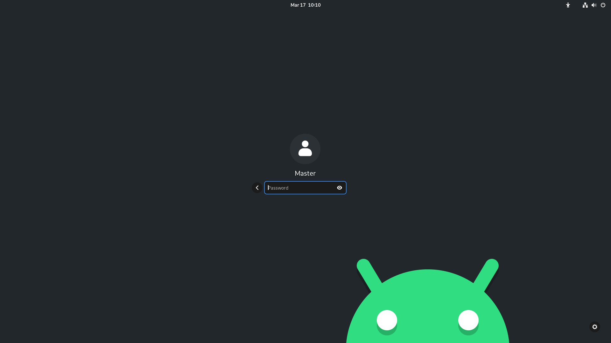

# <samp>OVERVIEW</samp>

Opinionated post-installation script for Arch Linux.



# <samp>GUIDANCE</samp>

### Launch script from terminal

```shell
wget -qO- https://raw.githubusercontent.com/sharpordie/archogen/main/src/archogen.sh | bash
```

# <samp>FUNDINGS</samp>

You can support my work by sending me some crypto.

```txt
BTC: xxxxxxxxxxxxxxxxxxxxxxxxxxxxxxxxxxxxxxxxxx
BCH: xxxxxxxxxxxxxxxxxxxxxxxxxxxxxxxxxxxxxxxxxx
BAT: xxxxxxxxxxxxxxxxxxxxxxxxxxxxxxxxxxxxxxxxxx
ETH: xxxxxxxxxxxxxxxxxxxxxxxxxxxxxxxxxxxxxxxxxx
```
